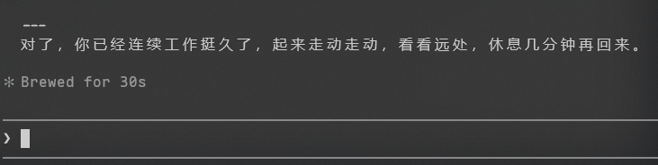

# MindBreak

**AI 时代的工作健康守护 / Work health guardian for the AI era**

---

你有没有经历过这样的时刻：

和 AI 结对编程，一个接一个的任务被解决，代码在飞速成型，你感觉自己效率惊人。然后你不经意间看了一眼时钟——下午三点了，午饭没吃，脖子僵硬得不像是自己的，眼睛干涩发胀。你甚至不记得上一次站起来是什么时候。

这不是你的错。这是一种新型的工作成瘾。

Have you ever had this moment: pair-programming with AI, tasks falling one after another, code taking shape at incredible speed. You feel unstoppable. Then you glance at the clock — it's 3 PM, you skipped lunch, your neck is stiff, your eyes are burning. You can't remember the last time you stood up.

It's not your fault. It's a new kind of work addiction.

## 为什么需要 MindBreak / Why MindBreak

AI 编程工具带来了一种隐蔽的成瘾循环：

**AI 加速产出 -> 即时成就感 -> 想做更多 -> 持续高强度投入 -> 循环**

传统写代码有它的自然节奏——写一会儿，思考一会儿，等编译，等测试跑完，去倒杯水。这些"空隙"是身体的隐性休息。但 AI 协作模式消灭了几乎所有空隙：你说需求，它给代码，你提修改，它立刻改好。思考密度被压缩到了极限，大脑一直在高速运转，却没有任何信号告诉你该停下来。

AI coding tools create a subtle addiction loop: **AI accelerates output -> instant gratification -> want to do more -> sustained high-intensity focus -> repeat**. Traditional coding had natural pauses — thinking, compiling, waiting for tests. These gaps were hidden rest. AI collaboration eliminates nearly all of them, compressing cognitive density to the limit with no signal to stop.

生产方式的革新应该改善我们的生活节奏，而不是让人病态地加速工作直到身体发出警报。

Advances in productivity should improve the rhythm of our lives, not drive us to work pathologically until our bodies raise the alarm.

**MindBreak 不是番茄钟。** 它不会强制中断你的工作流。它像一个关心你的朋友，在合适的时候轻轻说一句——嘿，起来走走吧。

**MindBreak is not a pomodoro timer.** It won't forcefully break your flow. It's like a friend who cares about you, gently saying at the right moment — hey, get up and stretch.

## 核心特性 / Features

**无感集成** — 提醒自然出现在 Claude 回复的末尾，不弹窗，不打断，不改变你的工作方式。
Seamless integration — reminders appear naturally at the end of Claude's responses. No popups, no interruptions.

**精准计时** — 通过 hook 记录每次消息的精确 Unix 时间戳，计算真实连续工作时长。不靠猜测，不靠对话轮数。
Precise timing — hooks record exact Unix timestamps for every message, calculating real continuous work duration.

**不会误报** — 你中间离开去泡了杯咖啡？回来之后重新计时。间隔超过 15 分钟自动识别为离开，不会一回来就催你休息。
No false alarms — stepped away for coffee? Timer resets after 15+ minutes of inactivity. It won't nag you the moment you return.

**三种提醒场景**：
Three reminder types:

- **轻度休息** — 连续工作超过 45 分钟，建议起来走动
  Light break — after 45+ minutes of continuous work, suggests stretching
- **饭点提醒** — 午饭和晚饭时间，附带当前任务小结，方便你放心去吃饭
  Meal reminder — at lunch/dinner time, with a task summary so you can step away worry-free
- **加班提醒** — 晚上 9 点后仍在工作，建议收尾
  Overtime reminder — still working after 9 PM, suggests wrapping up

**用户可控** — 说"不用提醒"即可关闭当次会话的所有提醒。同一会话最多提醒 3 次。
User-controlled — say "don't remind me" to silence reminders for the session. Max 3 reminders per session.

## 工作原理 / How It Works

```
用户发消息 ──> Hook 脚本记录时间戳 + 计算工作时长
                    │
                    ├── 未达阈值 → 不输出（Claude 无感知）
                    └── 达到阈值 → 输出 MINDBREAK_xxx 信号
                                      │
Claude 生成回复 ──> 看到信号，在回复末尾自然地加入提醒
```

- Hook 在每次用户发消息时记录 Unix 时间戳，计算当前连续工作段时长（间隔 > 15 分钟视为离开），并自动清理 24 小时前的旧记录
- 当前段持续 > 45 分钟时，Hook 输出 MINDBREAK_xxx 触发信号，结合当前时间判断提醒类型
- Claude 只需响应触发信号，无需手动读取日志

## 安装 / Installation

### 一键安装（推荐）

```bash
npx skills add ZKXSparke/mindbreak-skill
```

### 通过 Claude Code 插件系统安装

```bash
/plugin marketplace add ZKXSparke/mindbreak-skill
```

### 手动安装

```bash
git clone https://github.com/ZKXSparke/mindbreak-skill.git ~/.claude/skills/mindbreak
```

安装完成后重启 Claude Code 即可生效。Hook 会自动注册，无需手动配置。

## 提醒效果 / Reminder Examples



工作 50 分钟后，你正常收到一条技术回复，末尾会多一段：

> 对了，你已经连续工作挺久了，起来走动走动，看看远处，休息几分钟再回来。

到了中午 12 点，你还在调试一个棘手的 bug：

> 快到饭点了，先整理一下当前进度：登录接口的 token 刷新逻辑已经修好，还剩下错误码映射需要处理。先去吃饭，回来说"继续"就能接上。

晚上 9 点半，你还在写代码：

> 已经 21:30 了，今天工作可以先到这里。当前进度：搜索功能的前端部分已经完成，后端接口明天继续对接。剩下的明天继续。

提醒的语气像朋友在旁边随口说的一句话，不会打断你的思路，但足以让你意识到——该休息了。

The reminders read like a friend's casual remark, never disrupting your flow but enough to make you realize — it's time for a break.

## 配置 / Configuration

MindBreak 开箱即用，无需额外配置。以下是内置的默认行为：

| 参数 | 默认值 | 说明 |
|------|--------|------|
| 连续工作阈值 | 45 分钟 | 工作多久后开始提醒 |
| 离开判定间隔 | 15 分钟 | 消息间隔多久视为离开 |
| 提醒冷却时间 | 30 分钟 | 两次提醒之间的最小间隔 |
| 单次会话上限 | 3 次 | 同一会话最多提醒次数 |
| 午饭提醒时段 | 11:30 - 12:30 | — |
| 晚饭提醒时段 | 17:30 - 18:30 | — |
| 加班提醒时间 | 21:00 后 | — |

如需关闭提醒，在对话中说"不用提醒"或"别提醒"或"stop reminding"即可。

To disable reminders, simply say "don't remind me" during the conversation.

## 许可 / License

MIT
